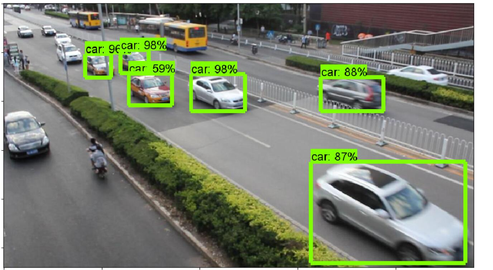

# 基于tensorflow的车辆检测

本项目基于tensorflow objection API和DETRAC数据库训练了车辆检测器，其效果如图所示:

## 代码准备

	git clone https://github.com/imistyrain/tensorflow-car

将代码存放的位置记为TENSORFLOW_CAR

接下来安装objectdetection模块

	git clone https://github.com/tensorflow/models.git
	cd models/research
	protoc object_detection/protos/*.proto --python_out=.

## 数据准备

选用的数据集为DETRAC，其包含了60个视频共计8万余张

下载地址:[http://detrac-db.rit.albany.edu/download](http://detrac-db.rit.albany.edu/Data/DETRAC-train-data.zip)

虽然其采用了xml存储，但是是把整个视频所有的标注都放到一个文件里面，因此需要我们把这些信息提取出来，转换为一张图片对应一个标注文件的VOC格式。

	cd ${TENSORFLOW_CAR}/car
	python showgt.py
	pyhton create_car_tf_record.py

## 训练

	cd ${TENSORFLOW_CAR}
	sh train.sh

## demo

	python demo.py

## 参考
[
DETRAC-Train-Images转换成VOC格式的数据集](https://blog.csdn.net/w5688414/article/details/78931910)
